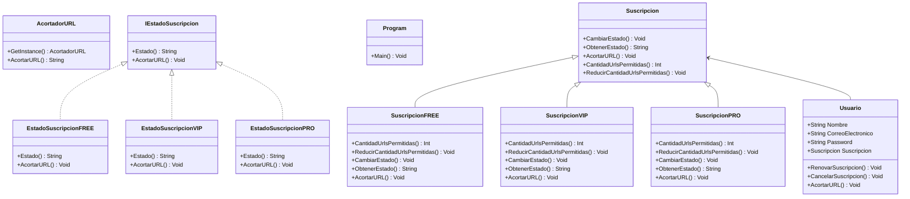

```mermaid
classDiagram

class AcortadorURL
AcortadorURL : +GetInstance() AcortadorURL
AcortadorURL : +AcortarURL() String

class EstadoSuscripcionFREE
EstadoSuscripcionFREE : +Estado() String
EstadoSuscripcionFREE : +AcortarURL() Void

class EstadoSuscripcionVIP
EstadoSuscripcionVIP : +Estado() String
EstadoSuscripcionVIP : +AcortarURL() Void

class EstadoSuscripcionPRO
EstadoSuscripcionPRO : +Estado() String
EstadoSuscripcionPRO : +AcortarURL() Void

class IEstadoSuscripcion
IEstadoSuscripcion : +Estado() String
IEstadoSuscripcion : +AcortarURL() Void

class Program
Program : +Main() Void

class Suscripcion
Suscripcion : +CambiarEstado() Void
Suscripcion : +ObtenerEstado() String
Suscripcion : +AcortarURL() Void
Suscripcion : +CantidadUrlsPermitidas() Int
Suscripcion : +ReducirCantidadUrlsPermitidas() Void

class SuscripcionFREE
SuscripcionFREE : +CantidadUrlsPermitidas() Int
SuscripcionFREE : +ReducirCantidadUrlsPermitidas() Void
SuscripcionFREE : +CambiarEstado() Void
SuscripcionFREE : +ObtenerEstado() String
SuscripcionFREE : +AcortarURL() Void

class SuscripcionVIP
SuscripcionVIP : +CantidadUrlsPermitidas() Int
SuscripcionVIP : +ReducirCantidadUrlsPermitidas() Void
SuscripcionVIP : +CambiarEstado() Void
SuscripcionVIP : +ObtenerEstado() String
SuscripcionVIP : +AcortarURL() Void

class SuscripcionPRO
SuscripcionPRO : +CantidadUrlsPermitidas() Int
SuscripcionPRO : +ReducirCantidadUrlsPermitidas() Void
SuscripcionPRO : +CambiarEstado() Void
SuscripcionPRO : +ObtenerEstado() String
SuscripcionPRO : +AcortarURL() Void

class Usuario
Usuario : +String Nombre
Usuario : +String CorreoElectronico
Usuario : +String Password
Usuario : +Suscripcion Suscripcion
Usuario : +RenovarSuscripcion() Void
Usuario : +CancelarSuscripcion() Void
Usuario : +AcortarURL() Void


IEstadoSuscripcion <|.. EstadoSuscripcionFREE
IEstadoSuscripcion <|.. EstadoSuscripcionVIP
IEstadoSuscripcion <|.. EstadoSuscripcionPRO
Suscripcion <|-- SuscripcionFREE
Suscripcion <|-- SuscripcionVIP
Suscripcion <|-- SuscripcionPRO
Suscripcion <-- Usuario

```
