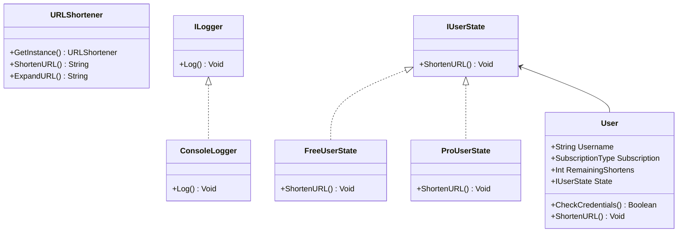

```mermaid
classDiagram

class URLShortener
URLShortener : +GetInstance() URLShortener
URLShortener : +ShortenURL() String
URLShortener : +ExpandURL() String

class ILogger
ILogger : +Log() Void

class ConsoleLogger
ConsoleLogger : +Log() Void

class IUserState
IUserState : +ShortenURL() Void

class FreeUserState
FreeUserState : +ShortenURL() Void

class ProUserState
ProUserState : +ShortenURL() Void

class User
User : +String Username
User : +SubscriptionType Subscription
User : +Int RemainingShortens
User : +IUserState State
User : +CheckCredentials() Boolean
User : +ShortenURL() Void


ILogger <|.. ConsoleLogger
IUserState <|.. FreeUserState
IUserState <|.. ProUserState
IUserState <-- User

```
